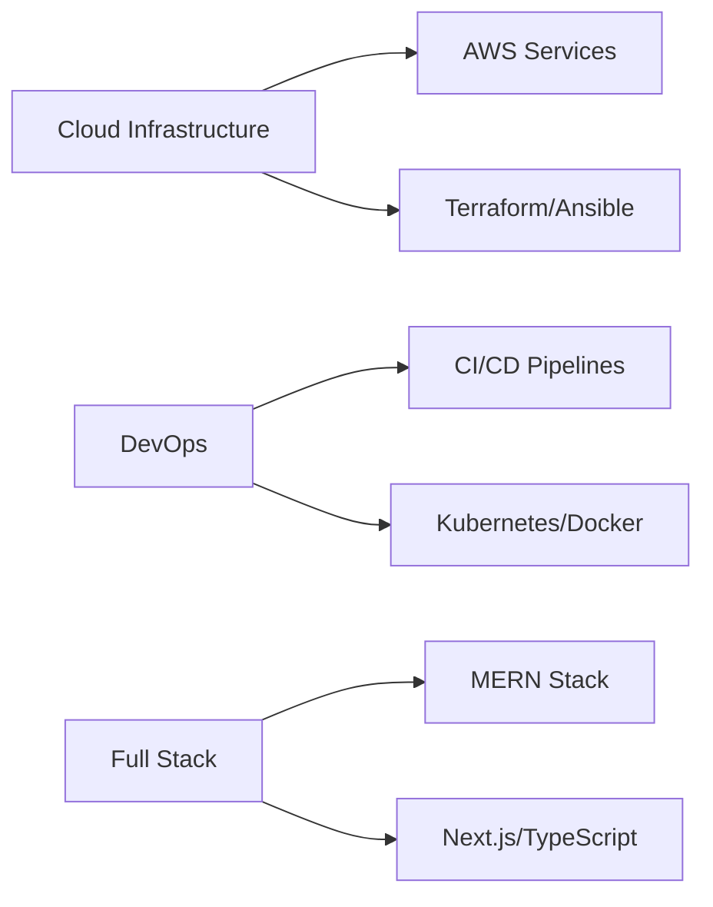
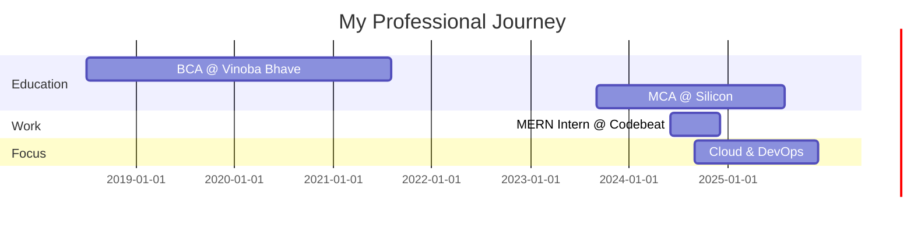

<div align="center">
  
  
  
  
  <br/>
  <br/>
  
  [](https://www.linkedin.com/in/aman-pushp-b1a501223/)
  [](https://aman-pushp-portfolio.netlify.app/)
  [](mailto:amanpushp2001@gmail.com)
  [](https://github.com/AMANPUSHP23)
  [](https://instagram.com/aman_pushp23)

  
  
  <br/>
  
  
  
  
</div>

<br/>

---

<h2> 👨🏻‍💻 &nbsp;A Little Bit About Me and My Interests</h2>

```yaml
name: Aman Pushp
located_in: Bangalore, Karnataka
searching_job: Devops Engineer,Full Stack Developer

education:
  - Bachelor's in Computer Applications (BCA) - Vinoba Bhave University (2018–2021)
  - Master's in Computer Applications (MCA) - Silicon University (2023–2025)

company: Searching

fields_of_interests:
  - Web Development
  - Software Development
  - Machine Learning
  - Game Development
  - DevOps & Cloud Engineering

technical_background:
  - Full Stack Developer
  - MERN Stack Developer Intern @ Codebeat (2024)
  - Gen AI Enthusiast
  - Blockchain
  - AWS Cloud (EC2, Lambda)
  - Docker & Kubernetes
  - CI/CD Pipelines

currently_learning:
  - Docker
  - Kubernetes
  - React Native

goals_2024:
  - Build 25+ Projects
  - Learn 5–10 New Technologies
  - Contribute to Open Source

projects:
  - Portfolio Website (React + Tailwind) - 2025
  - RoutineZen (Routine Tracking App) - 2025
  - Pushp-Setu (Home Management System) - 2025
  - AI-planner (AI-powered Dashboard) - 2025
  - Lifeline Blood System (Blood Donation System) - 2025

certifications:
  - MERN Stack Web Development
  - AWS Certification
  - DevOps Certification
  - Cyber Security Workshop
  - IoT & MIS Certifications
  - CodeClash 2025 – The Battle of Algorithms

hobbies:
  - Gaming
  - Cinema
  - Skateboarding
  - Art
  - Comedy

```
  
---  


<p align="left">  </p>

- ⚡ Fun fact **I AM FUNNY😂**


<h3 align="left">Languages and Tools:</h3>

<div align="center">

### ☁️ **Cloud & DevOps**


### 💻 **Frontend Development**


### 🔧 **Backend Development**


### 🗄️ **Databases**


### 🛠️ **Tools & Platforms**


</div>

---


<p align="left"> <a href="https://angular.io" target="_blank" rel="noreferrer">  </a> <a href="https://getbootstrap.com" target="_blank" rel="noreferrer">  </a> <a href="https://www.cprogramming.com/" target="_blank" rel="noreferrer">  </a> <a href="https://www.w3schools.com/cpp/" target="_blank" rel="noreferrer">  </a> <a href="https://www.w3schools.com/css/" target="_blank" rel="noreferrer">  </a> <a href="https://expressjs.com" target="_blank" rel="noreferrer">  </a> <a href="https://www.w3.org/html/" target="_blank" rel="noreferrer">  </a> <a href="https://www.java.com" target="_blank" rel="noreferrer">  </a> <a href="https://developer.mozilla.org/en-US/docs/Web/JavaScript" target="_blank" rel="noreferrer">  </a> <a href="https://www.linux.org/" target="_blank" rel="noreferrer">  </a> <a href="https://www.mongodb.com/" target="_blank" rel="noreferrer">  </a> <a href="https://www.mysql.com/" target="_blank" rel="noreferrer">  </a> <a href="https://nodejs.org" target="_blank" rel="noreferrer">  </a> <a href="https://www.oracle.com/" target="_blank" rel="noreferrer">  </a> <a href="https://www.php.net" target="_blank" rel="noreferrer">  </a> <a href="https://www.python.org" target="_blank" rel="noreferrer">  </a> <a href="https://reactjs.org/" target="_blank" rel="noreferrer">  </a> </p>


<!--Trophies Section-->   
<h2 align="center">🏆 Gɪᴛʜᴜʙ Tʀᴏᴘʜɪᴇs 🏆</h2>
<p align="center">
  <a href="https://github.com/amanpushp23">
    <picture>
      <source media="(prefers-color-scheme: dark)" srcset="https://github-profile-trophy.vercel.app/?username=amanpushp23&no-bg=true&row=2&column=6&margin-w=20&margin-h=20&theme=monokai">
      <source media="(prefers-color-scheme: light)" srcset="https://github-profile-trophy.vercel.app/?username=amanpushp23&no-bg=true&row=2&column=6&margin-w=20&margin-h=20">
      
    </picture>
  </a>
</p>
<br />

<!--Github stats Table--> 
<h2 align="center">📊 Gɪᴛʜᴜʙ Sᴛᴀᴛs 📊</h2>
<table width="100%">
  <tr>
    <td width="50%">
      <h3 align="center"><strong>Gɪᴛʜᴜʙ Sᴛᴀᴛs</strong></h3>
      <p align="center">
        <a href="https://github.com/amanpushp23">
          
        </a>
      </p>
    </td>
    <td width="50%">
      <h3 align="center"><strong>Sᴛʀᴇᴀᴋ Sᴛᴀᴛs</strong></h3>
      <p align="center">
        <a href="https://github.com/amanpushp23">
          
        </a>
      </p>
    </td>
  </tr>
  <tr>
    <td width="50%">
      <h3 align="center"><strong>Lᴀᴛᴇsᴛ Pʀᴏᴊᴇᴄᴛ</strong></h3>
      <p align="center">
        <a href="https://github.com/AMANPUSHP23/smartcalculator.git">
          
        </a>
      </p>
    </td>
    <td width="50%">
      <p align="center">
          
        </a>
      </p>
    </td>
  </tr>
</table>
<br />


<!--Contribution Graph-->
<h2 align="center">📈 Cᴏɴᴛʀɪʙᴜᴛɪᴏɴ Gʀᴀᴘʜ 📈</h2>
<div align="center">
    
</div>

---


## ☁️ **AWS Services Expertise**

<div align="center">

### Compute & Networking


### Storage & Database


### Security & Monitoring


### DevOps & IaC


**Total AWS Services:** 17+ | **Certification Goal:** AWS Solutions Architect Associate (2025)

</div>

---

## 📈 **Current Focus & Goals**

<div align="center">



</div>

**2025 Goals:**
- 🎯 Obtain AWS Solutions Architect Associate Certification
- 🎯 Contribute to 5+ Open Source DevOps Projects
- 🎯 Build Production-Grade Cloud Infrastructure
- 🎯 Master Advanced Kubernetes & Service Mesh (Istio)
- 🎯 Secure Cloud & DevOps Engineer Role

---

## 💼 **Experience Timeline**



---

## 🌐 **Connect & Collaborate**

<div align="center">
  
[](https://www.linkedin.com/in/aman-pushp-b1a501223/)
[](https://amanpushp23.netlify.app/)
[](mailto:amanpushp2001@gmail.com)
[](https://github.com/AMANPUSHP23)
[](https://x.com/amanpushp23)

### 💬 Open to:
✅ **Cloud & DevOps Engineering Opportunities**  
✅ **Full-time & Internship Roles**  
✅ **Open Source Collaborations**  
✅ **Freelance DevOps Projects**  
✅ **Technical Discussions & Mentorship**

</div>

---


<!--Dynamic Quote card updates everyday at 12 PM--> 
<h2 align="center">🌟 Tʜᴏᴜɢʜᴛ ᴏғ ᴛʜᴇ Dᴀʏ 🌟</h2>


<!--STARTS_HERE_QUOTE_CARD-->
<p align="center">
    
</p>

<!--ENDS_HERE_QUOTE_CARD-->


<div align="center">
  <p>Thanks for visiting! ❤️</p>
  <p>✨ Keep coding, keep creating, keep inspiring! ✨</p>
</div>
<!--Footer--> 
<p align="center">
  
</p>
